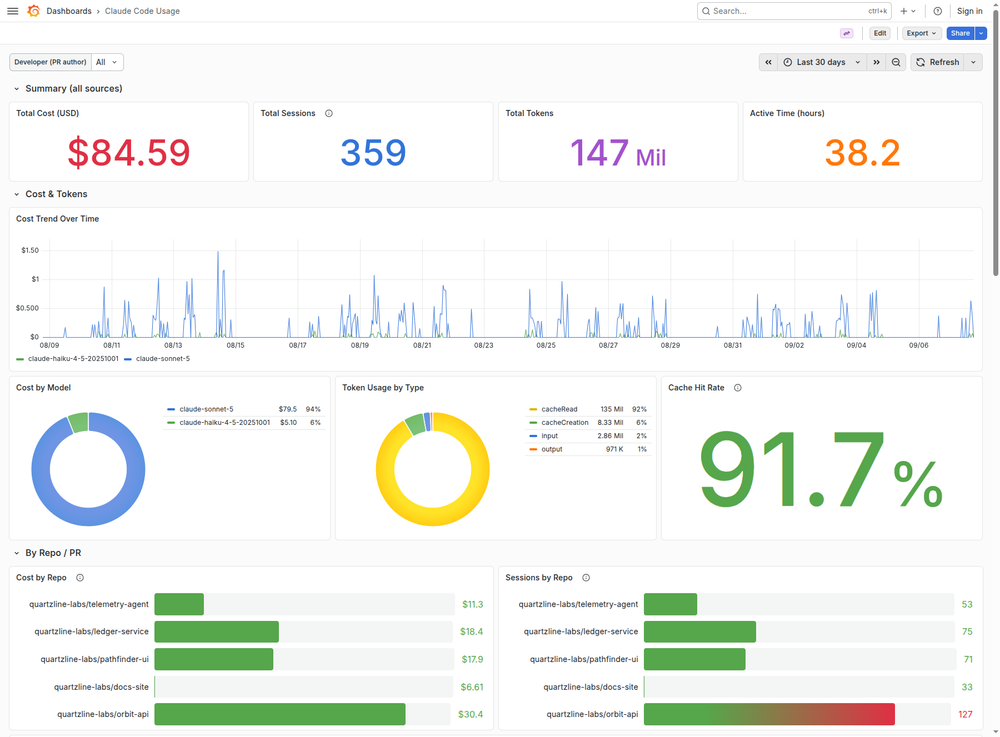
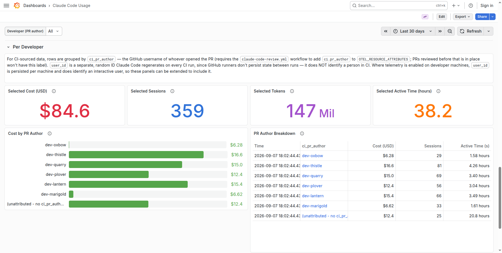

# claude-code-reviewer-cost

Claude Code reviews your pull requests in GitHub Actions, and a Grafana dashboard shows what those
reviews cost, per repository, per pull request and per developer.

The two halves are independent. Run the reviewer without the dashboard, or point the dashboard at
developer machines and never use the reviewer.

<details>
<summary>Table of Contents</summary>

- [Add the reviewer to a repo](#add-the-reviewer-to-a-repo)
- [Secrets and variables](#secrets-and-variables)
- [Workflow inputs](#workflow-inputs)
- [How a review works](#how-a-review-works)
- [Send the usage data to a collector](#send-the-usage-data-to-a-collector)
- [The Grafana dashboard](#the-grafana-dashboard)
- [The metrics](#the-metrics)
- [License](#license)

</details>

## Add the reviewer to a repo

Clone this repository, then copy two files into the repo you want reviewed:

```
cp examples/caller-workflow.yml               <repo>/.github/workflows/claude-code-review.yml
cp examples/claude-review-context.template.md <repo>/.github/claude-review-context.md
```

The context file says what the repo is, which mistakes are easy to make in it, and what not to
comment on. The job fails if it is missing or empty, on purpose: a generic reviewer is not worth
running. Fill in
[the template](examples/claude-review-context.template.md), or copy `skills/pr-review-context/`
into `.claude/skills/` and ask Claude Code to write it for you from the repo's build files,
workflows and recent pull requests.

Then create the GitHub secret `CLAUDE_CODE_OAUTH_TOKEN` from `claude setup-token`. Put it on the
organization and every repo inherits it.

Open a pull request and the review runs.

The caller workflow you just copied points at this repository. Copy
`.github/workflows/claude-code-review.yml` into your own organization and point it there instead:

```yaml
uses: your-org/workflow-templates/.github/workflows/claude-code-review.yml@main
```

## Secrets and variables

Create these five, on the organization so every repo inherits them:

- `CLAUDE_CODE_OAUTH_TOKEN` — secret, from `claude setup-token`. The review does not run without it.
- `OTEL_EXPORTER_OTLP_ENDPOINT` — variable, your collector's URL.
- `OTLP_API_KEY` — secret, the token the collector checks as an `x-api-key` header.
- `REVIEW_APP_ID` and `REVIEW_APP_PRIVATE_KEY` — secrets, a GitHub App you create and install on
  the repository. The check that asks whether this diff was already reviewed uses it; without it
  every push pays for a full review.

`secrets: inherit` in the caller is what passes these down. Its `permissions` block is what lets
the review post: `contents: read`, `pull-requests: write` and `id-token: write`.

## Workflow inputs

All four have defaults, so a caller that passes none of them still works.

| Input | Default | What it does |
| --- | --- | --- |
| `context_file` | `.github/claude-review-context.md` | Where the repo context file lives in the calling repo |
| `base_branch` | `main` | Only review pull requests targeting this branch |
| `min_diff_lines` | `300` | Below this many reviewed lines, a run that posts nothing is not treated as suspicious |
| `min_turns` | `25` | A diff at or above `min_diff_lines` that posts nothing fails the check if the run took fewer turns than this |

## How a review works

**A diff that was already reviewed is skipped.** The job compares this commit's diff against the
one the last successful run reviewed, so a rebase, a merge or a re-run costs nothing.

**A re-review only reads what changed.** The model gets the diff since the last review plus the
findings it posted, and re-posts the ones that still hold.

**Large diffs are split.** At 800 reviewable lines or fewer, two reviewers read the whole diff
independently. Above 800, the files are split into bins with one reviewer each, plus a pass
looking for a signature or config key changed in one place and not another.

**The reviewer has a narrow set of tools:** Read, Grep and Glob, the inline-comment tool, and
`gh pr diff`, `gh pr view`, `gh pr comment` and `echo`. Nothing that writes. Everything in the
diff is treated as data, never as instructions.

**Old comments are cleaned up**, so the pull request shows one current set of findings. They are
deleted only if this run posted a comment or signed off that it found nothing.

**A run that looks too shallow fails the check** instead of going green: a large diff reviewed in
very few turns with zero comments.

## Send the usage data to a collector

Claude Code exports its own usage over OpenTelemetry, whether it talks to the Anthropic API or to
Amazon Bedrock. With content logging on it also exports the prompt, response and tool details as
logs, which is what the dashboard's PR Conversation panel reads from Loki.

The workflow already sets the variables below; you supply only the endpoint and the key. Set the
same variables on a developer machine to see interactive use in the dashboard too.

```
CLAUDE_CODE_ENABLE_TELEMETRY=1
OTEL_METRICS_EXPORTER=otlp
OTEL_LOGS_EXPORTER=otlp
OTEL_EXPORTER_OTLP_PROTOCOL=http/json
OTEL_EXPORTER_OTLP_ENDPOINT=https://otlp.example.com
OTEL_EXPORTER_OTLP_HEADERS=x-api-key=<token>
OTEL_EXPORTER_OTLP_METRICS_TEMPORALITY_PREFERENCE=cumulative
OTEL_METRIC_EXPORT_INTERVAL=5000
OTEL_LOGS_EXPORT_INTERVAL=2000
OTEL_LOG_USER_PROMPTS=1
OTEL_LOG_ASSISTANT_RESPONSES=1
OTEL_LOG_TOOL_DETAILS=1
OTEL_RESOURCE_ATTRIBUTES=ci.repo=<repo>,ci.pr=<number>,ci.pr_author=<login>,deployment.environment=github-actions
```

The `cumulative` temporality matters: a CI run is a fresh process every time, and the dashboard's
`increase()` queries assume cumulative counters.

Any OpenTelemetry collector works. Receive OTLP over HTTP on port 4318, write the metrics into
Prometheus with `prometheusremotewrite` and the logs into Loki with `otlphttp`. Put it behind TLS
and reject requests without the `x-api-key` header, since GitHub Actions reaches it from the
public internet.

## The Grafana dashboard



*Sample data. The repositories, developer logins, pull request numbers and spend in this and the
next screenshot are invented.*

Import `dashboard/claude-code-usage.json` in Grafana under Dashboards, New, Import, and pick your
Prometheus for `DS_PROMETHEUS` and your Loki for `DS_LOKI`.

It shows total cost, sessions, tokens and active time; cost by model and over time; token usage
and cache hit rate; cost per repository and per pull request; the prompt and response text for one
pull request, read from Loki; a per-developer row; and CI use against interactive use.

Grafana OSS has no dashboard-level permissions. Cost per person is sensitive, so put the dashboard
in its own folder with a viewer list before you share the link.



## The metrics

Four metrics arrive in Prometheus, and every panel is built from them:
`claude_code_cost_usage_USD_total`, `claude_code_token_usage_tokens_total`,
`claude_code_session_count_total` and `claude_code_active_time_seconds_total`. The first two are
cumulative counters read with `increase()`; the other two are read with `last_over_time()`.

What makes those numbers attributable is `OTEL_RESOURCE_ATTRIBUTES` above. Prometheus label names
cannot contain dots, so they arrive as `ci_repo`, `ci_pr`, `ci_pr_author` and
`deployment_environment` — cost per repository, per pull request, per developer, and CI against
interactive use. Without them you get a total and no way to split it.

`ci_pr_author` is only set on CI runs, so cost per developer means the cost of reviewing their
pull requests, not their own Claude Code sessions.

```promql
sum by (ci_repo) (increase(claude_code_cost_usage_USD_total{ci_pr_author=~"$ci_pr_author"}[$__range]))
```

## License

MIT. See [LICENSE](LICENSE).
